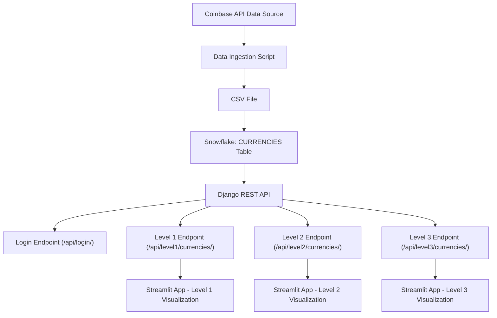

```markdown
# Coinbase-to-Snowflake-Django-Streamlit Project

## Overview

This project ingests cryptocurrency data from Coinbase’s currencies API, loads it into a Snowflake database, exposes the data via a Django REST API with three authorization levels, and visualizes the data using separate Streamlit applications. A custom login API endpoint is provided so that users can log in via session-based authentication. The three authorization levels are:

- **Level 1 (Public):** Minimal data (e.g. ID, status). No authentication required.
- **Level 2 (Authenticated):** A moderate subset of fields (e.g. ID, name, min_size, status, default_network, display_name). Requires login.
- **Level 3 (Admin):** All available fields. Accessible only to admin users (users with `is_staff` or `is_superuser` set to true).

---

## Project Structure

```
coinbaseapi/
├── .env                     # Environment variables file (contains sensitive info)
├── .gitignore               # Git ignore file (includes .env)
├── ingest_to_snowflake_csv.py   # Script to ingest data: fetch JSON, convert to CSV, load into Snowflake
├── manage.py                # Django project management file
├── api/                     # Django app with API views and URL configuration
│   ├── __init__.py
│   ├── urls.py              # API endpoints: login, level1, level2, level3
│   └── views.py             # API views implementation (including custom login)
├── requirements.txt         # Python package dependencies
├── streamlit_level1.py      # Streamlit app for Level 1 (public) visualization
├── streamlit_level2.py      # Streamlit app for Level 2 (authenticated) visualization
└── streamlit_level3.py      # Streamlit app for Level 3 (admin) visualization
```

---

## Flow Diagram

Below is a Mermaid diagram that illustrates the overall data flow. (If your GitHub README does not render Mermaid, use an online Mermaid Live Editor to generate an image.)



**Diagram Explanation:**

1. **Coinbase API Data Source:** Data is fetched from Coinbase’s currencies API.
2. **Data Ingestion Script:** Retrieves JSON data, converts it into a CSV file.
3. **CSV File:** Contains all the keys as columns.
4. **Snowflake: CURRENCIES Table:** The CSV file is loaded into this table (the table is dropped and recreated with each ingestion).
5. **Django REST API:** Connects to Snowflake and exposes multiple endpoints:
   - **Login Endpoint:** Allows users to log in and obtain a session.
   - **Level 1 Endpoint:** Public data.
   - **Level 2 Endpoint:** Authenticated data.
   - **Level 3 Endpoint:** Admin-only data.
6. **Streamlit Visualization Apps:** Separate apps visualize data for each level.

---

## Installation and Setup

### Prerequisites

- **Python 3.8+** with `pip`
- **Django** and **Django REST Framework**
- **Streamlit**
- **Snowflake Connector for Python**
- A **Snowflake Account**
- **SnowSQL** (optional, see installation instructions below)
- Garuda Linux (or another Arch-based distro)

### 1. Clone the Repository and Install Dependencies

Clone the repository and install the required packages:

```bash
git clone https://github.com/yourusername/coinbaseapi.git
cd coinbaseapi
pip install -r requirements.txt
```

*Example `requirements.txt`:*
```
Django>=3.2
djangorestframework
requests
snowflake-connector-python
streamlit
python-dotenv
```

### 2. Configure Environment Variables

Create a `.env` file in the root of your project (next to `manage.py`) with your Snowflake credentials and any other sensitive settings:

```ini
# .env
SNOWFLAKE_USER=your_snowflake_user
SNOWFLAKE_PASSWORD=your_snowflake_password
SNOWFLAKE_ACCOUNT=your_snowflake_account
SNOWFLAKE_WAREHOUSE=your_snowflake_warehouse
SNOWFLAKE_DATABASE=your_snowflake_database
SNOWFLAKE_SCHEMA=your_snowflake_schema
```

**Important:**  
Add the `.env` file to your `.gitignore` file to ensure it is not committed to GitHub. Your `.gitignore` should include:

```gitignore
.env
```

If you have already committed it, remove it from tracking with:

```bash
git rm --cached .env
git commit -m "Remove .env from version control"
```

### 3. Load Data into Snowflake

Run the ingestion script to fetch data from Coinbase, convert it to a CSV file, drop and recreate the table in Snowflake, and load the data:

```bash
python ingest_to_snowflake_csv.py
```

### 4. Configure and Run the Django Server

Ensure your Django settings are properly configured (e.g., add `api` and `rest_framework` to `INSTALLED_APPS`). Then, start the Django development server:

```bash
python manage.py runserver
```

Your API endpoints will be available at:

- Public Data (Level 1): `http://127.0.0.1:8000/api/level1/currencies/`
- Login: `http://127.0.0.1:8000/api/login/`
- Authenticated Data (Level 2): `http://127.0.0.1:8000/api/level2/currencies/`
- Admin Data (Level 3): `http://127.0.0.1:8000/api/level3/currencies/`

### 5. Run the Streamlit Applications

Open separate terminal windows or tabs and run the following commands:

- **Level 1 (Public):**

  ```bash
  streamlit run streamlit_level1.py --server.port 8501
  ```

- **Level 2 (Authenticated):**

  ```bash
  streamlit run streamlit_level2.py --server.port 8502
  ```

- **Level 3 (Admin):**

  ```bash
  streamlit run streamlit_level3.py --server.port 8503
  ```


---

## Usage and Workflow

1. **Data Ingestion:**  
   The ingestion script fetches data from Coinbase, converts it into a CSV file, and loads it into the `CURRENCIES` table in Snowflake.

2. **Django REST API:**  
   The Django API connects to Snowflake and provides endpoints:
   - **Login Endpoint:** (`/api/login/`) Allows users to log in and obtain a session.
   - **Level 1 Endpoint:** Publicly available.
   - **Level 2 Endpoint:** Accessible only to logged-in (authenticated) users.
   - **Level 3 Endpoint:** Accessible only to admin users.

3. **Streamlit Visualization:**  
   Separate Streamlit applications are used to visualize data for each authorization level:
   - **Level 1 Visualization:** Public data (no login required).
   - **Level 2 Visualization:** Requires user login.
   - **Level 3 Visualization:** Requires admin login.

---

## Notes

- **Environment Security:**  
  Ensure your `.env` file is excluded from version control by listing it in `.gitignore`.

- **Authentication:**  
  The project includes a custom login API endpoint that facilitates session-based authentication, which is used by the Streamlit apps to access protected API endpoints.

- **Customization:**  
  You can customize the API views and data filtering logic in Django as needed.

---


```

---

You can save this content as your `README.md` file in the project root. This file now includes all updated instructions, a corrected Mermaid flow diagram, details on environment configuration, and SnowSQL installation instructions for Garuda Linux.
